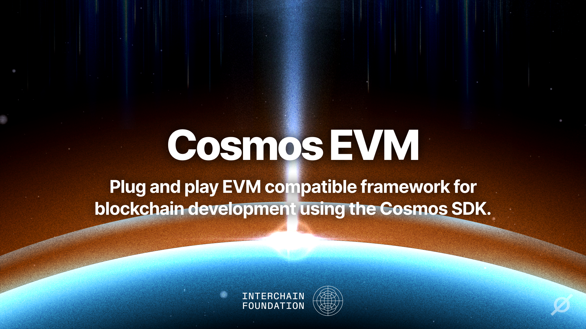

**Please note**: This repo is undergoing changes in preparation for a new audit. After this audit we will cut the first
v1 release, targeting late Q2. Some breaking changes might occur. While the Cosmos EVM is currently being used in
production on various chains without fault, Interchain Labs will only mark this repository as stable after the audit is completed.

**Visit the official documentation for Cosmos EVM**: [evm.cosmos.network](https://evm.cosmos.network/)

## What is Cosmos EVM?

Cosmos EVM is a plug-and-play solution that adds EVM compatibility
and customizability to your Cosmos SDK chain.

- Build an app-chain with the control and extensibility of the Cosmos SDK
- With native support for EVM as VM and seamless EVM<>Cosmos wallet / token / user experience.
- Leverage IBC with EVM, native support of ERC20 on Cosmos, and more with extensions and precompiles.

Cosmos EVM is a fork of [evmOS](https://github.com/evmos/OS), maintained by Interchain Labs and the Interchain Foundation
after the latter funded Tharsis to open-source the original codebase.

**Cosmos EVM is fully open-source under the Apache 2.0 license.** With this open-sourced version, you can get:

- Full access to Cosmos EVM's modules and updates
- Smooth onboarding experience for an existing or new Cosmos chain
- Full access to product partnerships (block explorers, RPCs, indexers etc.)
- Continuous upgrades, access to product and engineering support

**Want to use Cosmos EVM but want to discuss it with an expert first? [Contact the Interchain Labs team](https://share-eu1.hsforms.com/2g6yO-PVaRoKj50rUgG4Pjg2e2sca).**

For live discussions or support regarding advisories, join the #cosmos-tech channel in Slack.
[Get a Slack invite here](https://forms.gle/A8jawLgB8zuL1FN36) or join the [Telegram Group](https://t.me/cosmostechstack)

## Plug-in Cosmos EVM into your chain

### Integration

Cosmos EVM can easily be integrated into your existing chain
or added during the development of your upcoming chain launch
by importing Cosmos EVM as a go module library.
The Interchain Labs team provides you with integration guides and core protocol support depending on your needs and configurations.
**Updated documentation will be releasing soon!**

### Configurations

Cosmos EVM solution is engineered to provide unique flexibility,
empowering you to tailor every aspect of your Ethereum Virtual Machine (EVM) environment.
Whether you're launching a new blockchain or optimizing an existing one,
the Cosmos EVM offers a suite of features designed to meet the unique demands of your project.

#### Powerful defaults

Cosmos EVM’s modules come out of the box with defaults that will get you up and running instantly.

When integrating all available modules you will get a *permissionless EVM-enabled* blockchain
that *exposes JSON-RPC* endpoints for connectivity with all EVM tooling
like wallets ([MetaMask](https://metamask.io/), [Rabby](https://rabby.io/), and others)
or block explorers ([Blockscout](https://docs.blockscout.com/) and others).
You will have access to *all of Cosmos EVM’ extensions*,
which enable access to chain-native functionality
through [Solidity](https://docs.soliditylang.org/en/v0.8.26/) smart contracts.
Your chain provides a *seamless use of any IBC asset in the EVM*
without liquidity fragmentation between wrapped and unwrapped tokens.
Transaction surges are handled by the *self-regulating fee market mechanism* based on EIP-1559
and EIP-712 allows for *structured data si gning* for arbitrary messages.

*Everything* can be controlled by on-chain governance
to create alignment between chain teams and their communities.

#### Extensive customizations

Based on these powerful defaults, the feature set is easily and highly customizable:

- *Permissioned/Restricted EVM*

  Maintain control over your network with permissioned or restricted EVM capabilities.
  Implement customized access controls to either blacklist or whitelist individual addresses for calling
  and/or creating smart contracts on the network.

- *EVM Extensions*

  Extend the capabilities of your EVM!
  These EVM extensions allow functionality
  that is native to Cosmos SDK modules to be accessible from Solidity smart contracts.
  We provide a selection of plug-and-play EVM extensions that are ready to be used *today*.

  Push the boundaries of what’s possible with fully custom EVM extensions.
  Develop the  business logic that sets your chain apart from others with the mature tooling for the Go language
  and offer its functionality to the masses of Solidity smart contract developers
  to integrate in their dApps.

- *Single Token Representation v2 & ERC-20 Module*

  Simplify token management with Single Token Representation v2
  and our `x/erc20` module to elevate the user experience on your chain.
  Align IBC coins and ERC-20s and say goodbye to fragmented liquidity.
  One balance. In every tool.

- *EIP-1559 Fee Market Mechanism*

  Take control of transaction costs with our
  ready-to-use [EIP-1559 fee market](https://eips.ethereum.org/EIPS/eip-1559) solution.
  Tailor fee structures to suit your network’s specific needs,
  balancing user affordability with network sustainability.
  Or disable it altogether.

- *JSON-RPC Server*

  There is full control over the exposed namespaces and fine-grained control of the
  [JSON-RPC server](https://docs.evmos.org/develop/api/ethereum-json-rpc).
  Adjust the configuration to your liking,
  including custom timeouts for EVM calls or HTTP requests,
  maximum block gas, the number of maximum open connections, and more.

- *EIP-712 Signing*

  You have the option to integrate our [EIP-712 signature](https://eips.ethereum.org/EIPS/eip-712) implementation,
  which allows Cosmos SDK messages to be signed with EVM wallets like MetaMask.

- *Custom Improvement Proposals (Opcodes)*

  Any Cosmos EVM user is provided the opportunity to customize bits of their EVM opcodes and add new ones.
  Read more on [custom operations here](https://docs.evmos.org/develop/smart-contracts/custom-improvement-proposals).

### Forward-compatibility with Ethereum

Ethereum-equivalence describes any EVM solution,
that is identical in transaction execution to the Ethereum client.
It does not more, but also not less than that.  
Ethereum-compatible means,
that the EVM can be set up to run every transaction that is valid on Ethereum,
while the handling of the transactions can diverge in e.g. result or cost.

We like to coin the term **forward-compatible**
as a description of our EVM solution,
meaning that any Cosmos EVM chain can run any valid smart contract
from Ethereum but can also implement new features that are
not (yet) available on the standard Ethereum VM,
thus moving the standard forward.

## Open-source License & Credits

Cosmos EVM is open-source under the Apache 2.0 license, an extension of the license of the original codebase (https://github.com/evmos/OS)
created by Tharsis and the evmOS team - who conducted the foundational work for EVM compatibility and
interoperability in Cosmos.
